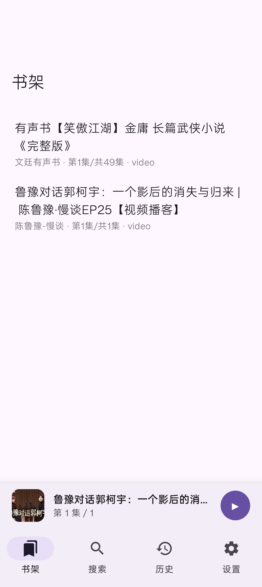

# BiliTing

B 站听书 Android 客户端。

[📦 下载 APK](../../releases/latest)

## 截图

| 搜索 | 播放 | UP 主主页 | 书架 |
| :---: | :---: | :---: | :---: |
|  |  |  |  |

## 功能

- 搜索 + 播放
- 收藏（书架）+ 历史
- 后台播放、选集、倍速、定时
- 主题跟随系统

## 构建

需求 JDK 17 + Android SDK（compileSdk 36，minSdk 26）。

```bash
cd BiliTing
gradlew.bat assembleRelease
```

产物：`app/build/outputs/apk/release/app-release.apk`

## 技术栈

Kotlin · Jetpack Compose · Material 3 · Retrofit · Room · ExoPlayer

## License

MIT